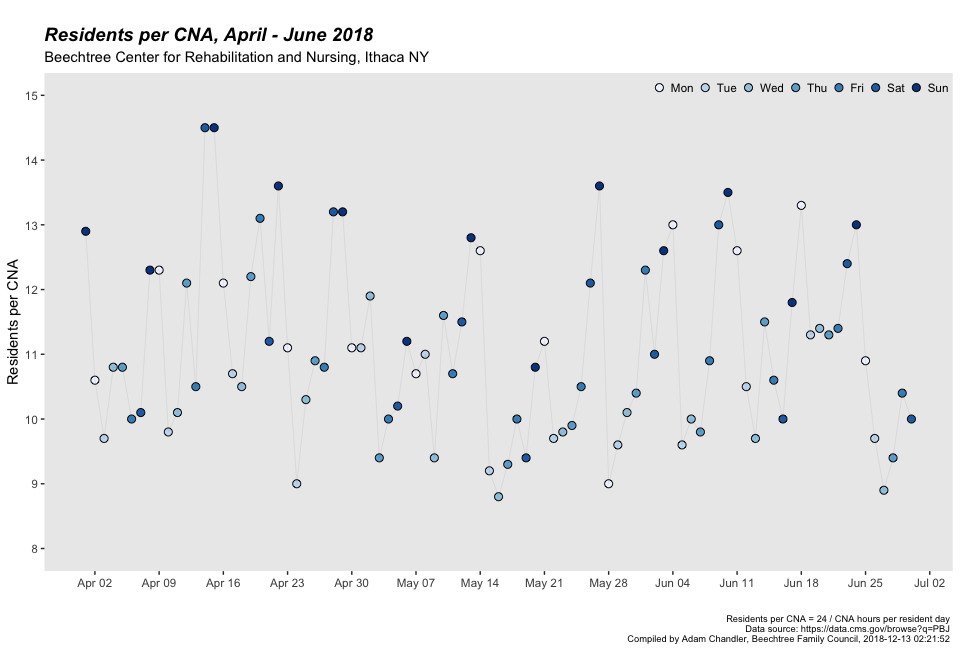

## Visualization with R: Beechtree Example

## CFR 483.30 

(e) Nurse staffing information  

(1) Data requirements. The facility must post the following information on a daily basis:  
(i) Facility name.  
(ii) The current date.  
(iii) The total number and the actual hours worked by the following categories of licensed and unlicensed nursing staff directly responsible for resident care per shift: (A) Registered nurses. (B) Licensed practical nurses or licensed vocational nurses (as defined under State law). (C) Certified nurse aides.  
(iv) Resident census.  

(2) Posting requirements.  
(i) The facility must post the nurse staffing data specified in paragraph (e)(1) of this section on a daily basis at the beginning of each shift.  
(ii) Data must be posted as follows: (A) Clear and readable format. (B) In a prominent place readily accessible to residents and visitors.  

(3) Public access to posted nurse staffing data. The facility must, upon oral or written request, make nurse staffing data available to the public for review at a cost not to exceed the community standard.

(4) Facility data retention requirements. The facility must maintain the posted daily nurse staffing data for a minimum of 18 months, or as required by State law, whichever is greater.  


## Example staff posting

  

## Data


```r
# load libraries

library(tidyverse)
library(lubridate)
library(stringr)
```


```r
# load and prepare data

df_newyork <- read_rds("data/newyork_2018.rds")
df <- df_newyork %>%
  filter(provnum == '335017')
```


```r
# explore the data

glimpse(df)
```

```
## Observations: 181
## Variables: 29
## $ provnum             <chr> "335017", "335017", "335017", "335017", "3...
## $ provname            <chr> "BEECHTREE CENTER FOR REHABILITATION AND N...
## $ workdate            <date> 2018-01-01, 2018-01-02, 2018-01-03, 2018-...
## $ mdscensus           <int> 101, 101, 102, 102, 104, 104, 104, 107, 10...
## $ hrs_rndon           <dbl> 0, 8, 8, 8, 8, 0, 0, 8, 8, 8, 8, 8, 0, 0, ...
## $ hrs_rndon_emp       <dbl> 0, 8, 8, 8, 8, 0, 0, 8, 8, 8, 8, 8, 0, 0, ...
## $ hrs_rndon_ctr       <dbl> 0, 0, 0, 0, 0, 0, 0, 0, 0, 0, 0, 0, 0, 0, ...
## $ hrs_rnadmin         <dbl> 0.00, 24.00, 23.50, 23.50, 25.50, 0.00, 0....
## $ hrs_rnadmin_emp     <dbl> 0.00, 24.00, 23.50, 23.50, 25.50, 0.00, 0....
## $ hrs_rnadmin_ctr     <dbl> 0, 0, 0, 0, 0, 0, 0, 0, 0, 0, 0, 0, 0, 0, ...
## $ hrs_rn              <dbl> 80.00, 71.00, 75.00, 74.00, 62.50, 46.75, ...
## $ hrs_rn_emp          <dbl> 80.00, 71.00, 75.00, 74.00, 62.50, 46.75, ...
## $ hrs_rn_ctr          <dbl> 0, 0, 0, 0, 0, 0, 0, 0, 0, 0, 0, 0, 0, 0, ...
## $ hrs_lpnadmin        <dbl> 0, 0, 0, 0, 0, 0, 0, 0, 0, 0, 0, 0, 0, 0, ...
## $ hrs_lpnadmin_emp    <dbl> 0, 0, 0, 0, 0, 0, 0, 0, 0, 0, 0, 0, 0, 0, ...
## $ hrs_lpnadmin_ctr    <int> 0, 0, 0, 0, 0, 0, 0, 0, 0, 0, 0, 0, 0, 0, ...
## $ hrs_lpn             <dbl> 62.25, 65.50, 74.25, 74.00, 81.25, 45.75, ...
## $ hrs_lpn_emp         <dbl> 46.25, 49.25, 43.00, 52.75, 42.00, 29.75, ...
## $ hrs_lpn_ctr         <dbl> 16.00, 16.25, 31.25, 21.25, 39.25, 16.00, ...
## $ hrs_cna             <dbl> 169.00, 174.75, 204.50, 197.75, 175.00, 19...
## $ hrs_cna_emp         <dbl> 169.00, 174.75, 197.00, 197.75, 167.50, 19...
## $ hrs_cna_ctr         <dbl> 0.00, 0.00, 7.50, 0.00, 7.50, 2.00, 15.50,...
## $ cna_hprd            <dbl> 1.67, 1.73, 2.00, 1.94, 1.68, 1.86, 1.50, ...
## $ lpn_hprd            <dbl> 0.62, 0.65, 0.73, 0.73, 0.78, 0.44, 0.57, ...
## $ rn_hprd             <dbl> 0.79, 0.70, 0.74, 0.73, 0.60, 0.45, 0.30, ...
## $ day                 <ord> Mon, Tue, Wed, Thu, Fri, Sat, Sun, Mon, Tu...
## $ residents_per_cna   <dbl> 14.4, 13.9, 12.0, 12.4, 14.3, 12.9, 16.0, ...
## $ residents_per_rnlpn <dbl> 17.0, 17.8, 16.3, 16.4, 17.4, 27.0, 27.6, ...
## $ daytype             <ord> weekday, weekday, weekday, weekday, weekda...
```


## Visualization


```r
df_q2 <- df %>%
  filter(workdate > "2018-03-31")

ggplot(df_q2, aes(workdate, residents_per_cna), vjust = 0.3) +
  geom_point(size = 2.5, aes(fill = day), shape = 21) + scale_fill_brewer("day") +
  geom_line(size = 0.02) +
  #scale_x_date(date_breaks="1 week", date_labels = "%A %b %d" ) +
  scale_x_date(date_breaks="1 week", date_labels = "%b %d" ) +
  scale_y_continuous(limits = c(8, 15), breaks = seq(8,15, by = 1)) +
  ggtitle("\nResidents per CNA, April - June 2018", subtitle = "Beechtree Center for Rehabilitation and Nursing, Ithaca NY") +
  xlab("") +
  ylab("\nResidents per CNA") +
  labs(caption = paste("Residents per CNA = 24 / CNA hours per resident day \nData source: https://data.cms.gov/browse?q=PBJ \nCompiled by Adam Chandler, Beechtree Family Council,", now(), "\n\n")) +
  theme(axis.text.x = element_text(angle = 30, hjust = 1)) +
  theme(panel.grid.minor.y = element_blank(),
        panel.grid.major.y = element_blank(),
        panel.grid.major.x = element_blank(),
        panel.grid.minor.x = element_blank(),
        plot.title = element_text(size=14, face="bold.italic"),
        plot.caption = element_text(size = 7),
        legend.position = c(0.8, 0.97),
        legend.key = element_blank(),
        legend.background = element_blank(),
        legend.direction = "horizontal",
        legend.title = element_blank()
  ) +
  guides(fill=guide_legend(nrow=1))
```

<!-- -->

