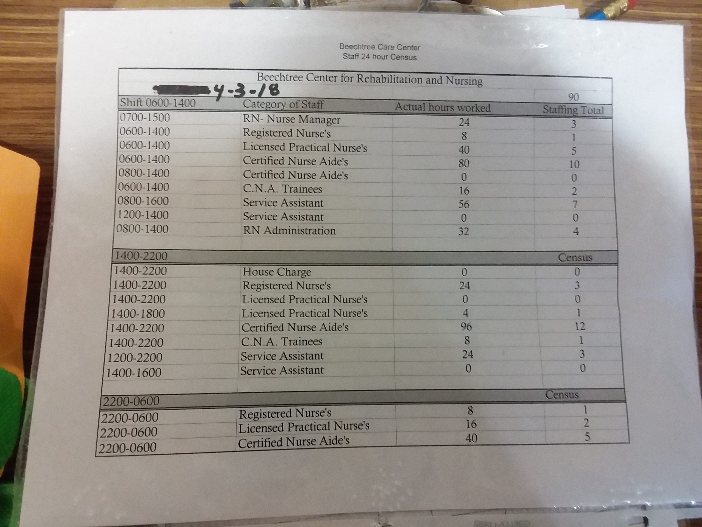
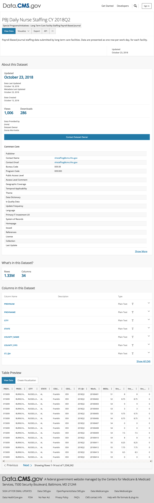
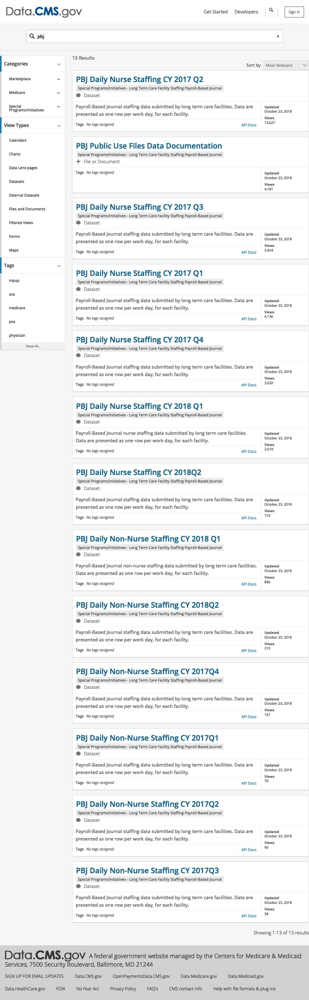

```r
# load libraries

library(tidyverse)
library(lubridate)
library(stringr)
library(webshot)
```


```r
webshot("http://beechtreecenter.com/", "data/beechtree_website.jpg", delay = 0.5)
```

<!-- -->

# 42 CFR 483.30 - Nursing services.

(e) Nurse staffing information  

(1) Data requirements. The facility must post the following information on a daily basis:  
(i) Facility name.  
(ii) The current date.  
(iii) The total number and the actual hours worked by the following categories of licensed and unlicensed nursing staff directly responsible for resident care per shift: (A) Registered nurses. (B) Licensed practical nurses or licensed vocational nurses (as defined under State law). (C) Certified nurse aides.  
(iv) Resident census.  

(2) Posting requirements.  
(i) The facility must post the nurse staffing data specified in paragraph (e)(1) of this section on a daily basis at the beginning of each shift.  
(ii) Data must be posted as follows: (A) Clear and readable format. (B) In a prominent place readily accessible to residents and visitors.  

(3) Public access to posted nurse staffing data. The facility must, upon oral or written request, make nurse staffing data available to the public for review at a cost not to exceed the community standard.

(4) Facility data retention requirements. The facility must maintain the posted daily nurse staffing data for a minimum of 18 months, or as required by State law, whichever is greater.  

source: https://www.gpo.gov/fdsys/granule/CFR-2011-title42-vol5/CFR-2011-title42-vol5-sec483-30 


## Example staff posting

  

## Data


```r
# load and prepare PBJ data from CMS
# https://data.cms.gov/browse?q=pbj&sortBy=relevance
# newyork_2018.rds is a subset of the PBJ data. RDS is a fileformat used in R, which saves column data types.

df_newyork <- read_rds("data/newyork_2018.rds")
df <- df_newyork %>%
  filter(provnum == '335017')
```


```r
# explore the data

glimpse(df)
```

```
## Observations: 181
## Variables: 29
## $ provnum             <chr> "335017", "335017", "335017", "335017", "3...
## $ provname            <chr> "BEECHTREE CENTER FOR REHABILITATION AND N...
## $ workdate            <date> 2018-01-01, 2018-01-02, 2018-01-03, 2018-...
## $ mdscensus           <int> 101, 101, 102, 102, 104, 104, 104, 107, 10...
## $ hrs_rndon           <dbl> 0, 8, 8, 8, 8, 0, 0, 8, 8, 8, 8, 8, 0, 0, ...
## $ hrs_rndon_emp       <dbl> 0, 8, 8, 8, 8, 0, 0, 8, 8, 8, 8, 8, 0, 0, ...
## $ hrs_rndon_ctr       <dbl> 0, 0, 0, 0, 0, 0, 0, 0, 0, 0, 0, 0, 0, 0, ...
## $ hrs_rnadmin         <dbl> 0.00, 24.00, 23.50, 23.50, 25.50, 0.00, 0....
## $ hrs_rnadmin_emp     <dbl> 0.00, 24.00, 23.50, 23.50, 25.50, 0.00, 0....
## $ hrs_rnadmin_ctr     <dbl> 0, 0, 0, 0, 0, 0, 0, 0, 0, 0, 0, 0, 0, 0, ...
## $ hrs_rn              <dbl> 80.00, 71.00, 75.00, 74.00, 62.50, 46.75, ...
## $ hrs_rn_emp          <dbl> 80.00, 71.00, 75.00, 74.00, 62.50, 46.75, ...
## $ hrs_rn_ctr          <dbl> 0, 0, 0, 0, 0, 0, 0, 0, 0, 0, 0, 0, 0, 0, ...
## $ hrs_lpnadmin        <dbl> 0, 0, 0, 0, 0, 0, 0, 0, 0, 0, 0, 0, 0, 0, ...
## $ hrs_lpnadmin_emp    <dbl> 0, 0, 0, 0, 0, 0, 0, 0, 0, 0, 0, 0, 0, 0, ...
## $ hrs_lpnadmin_ctr    <int> 0, 0, 0, 0, 0, 0, 0, 0, 0, 0, 0, 0, 0, 0, ...
## $ hrs_lpn             <dbl> 62.25, 65.50, 74.25, 74.00, 81.25, 45.75, ...
## $ hrs_lpn_emp         <dbl> 46.25, 49.25, 43.00, 52.75, 42.00, 29.75, ...
## $ hrs_lpn_ctr         <dbl> 16.00, 16.25, 31.25, 21.25, 39.25, 16.00, ...
## $ hrs_cna             <dbl> 169.00, 174.75, 204.50, 197.75, 175.00, 19...
## $ hrs_cna_emp         <dbl> 169.00, 174.75, 197.00, 197.75, 167.50, 19...
## $ hrs_cna_ctr         <dbl> 0.00, 0.00, 7.50, 0.00, 7.50, 2.00, 15.50,...
## $ cna_hprd            <dbl> 1.67, 1.73, 2.00, 1.94, 1.68, 1.86, 1.50, ...
## $ lpn_hprd            <dbl> 0.62, 0.65, 0.73, 0.73, 0.78, 0.44, 0.57, ...
## $ rn_hprd             <dbl> 0.79, 0.70, 0.74, 0.73, 0.60, 0.45, 0.30, ...
## $ day                 <ord> Mon, Tue, Wed, Thu, Fri, Sat, Sun, Mon, Tu...
## $ residents_per_cna   <dbl> 14.4, 13.9, 12.0, 12.4, 14.3, 12.9, 16.0, ...
## $ residents_per_rnlpn <dbl> 17.0, 17.8, 16.3, 16.4, 17.4, 27.0, 27.6, ...
## $ daytype             <ord> weekday, weekday, weekday, weekday, weekda...
```


## Visualization


```r
# filter to 2018 q2 only
df_q2 <- df %>%
  filter(workdate > "2018-03-31")

ggplot(df_q2, aes(workdate, residents_per_cna), vjust = 0.3) +
  geom_point(size = 2.5, aes(fill = day), shape = 21) + scale_fill_brewer("day") +
  geom_line(size = 0.02) +
  scale_x_date(date_breaks="1 week", date_labels = "%b %d" ) +
  scale_y_continuous(limits = c(8, 15), breaks = seq(8,15, by = 1)) +
  ggtitle("\nResidents per CNA, April - June 2018", subtitle = "Beechtree Center for Rehabilitation and Nursing, Ithaca NY") +
  xlab("") +
  ylab("Residents per CNA") +
  labs(caption = paste("Residents per CNA = 24 / CNA hours per resident day \nData source: https://data.cms.gov/browse?q=PBJ \nCompiled by Adam Chandler, Beechtree Family Council,", now(), "\n\n")) +
  theme(axis.text.x = element_text(angle = 0, hjust = 0.5)) +
  theme(panel.grid.minor.y = element_blank(),
        panel.grid.major.y = element_blank(),
        panel.grid.major.x = element_blank(),
        panel.grid.minor.x = element_blank(),
        plot.title = element_text(size=14, face="bold.italic"),
        plot.caption = element_text(size = 7),
        legend.position = c(0.83, 0.97),
        legend.key = element_blank(),
        legend.background = element_blank(),
        legend.direction = "horizontal",
        legend.title = element_blank()
  ) +
  guides(fill=guide_legend(nrow=1))
```

<!-- -->


```r
ggsave(plot = last_plot(), filename = "output/beechtree_cna_staffing_pbj_2018_apr-jun.jpg", width=11, height=7,dpi = 600)
```

## Additional context


### Beechtree Family Council

https://osf.io/awfhp/wiki/home/ 

Butler, Matt. “Nursing Home Shade.” Ithaca Times, November 18, 2018, pp. 1,7-8. https://issuu.com/ithacatimes/docs/november_14__2018

“Staffing Issues at New York Nursing Homes.” News Radio 810 & 103.1 WGY, July 27, 2018. https://wgy.iheart.com/content/2018-07-27-staffing-issues-at-new-york-nursing-homes/.

Rau, Jordan. “New Data Set Helps Reporter Pinpoint Critical Staffing Concerns in Skilled Nursing Facilities.” Association of Health Care Journalists, July 25, 2018. https://healthjournalism.org/resources-articles-details.php?id=429#.W1nMUNIzq00.

“‘Like A Ghost Town’: Erratic Nursing Home Staffing Revealed Through New Records,” July 18, 2018. Huffington Post. https://www.huffingtonpost.com/entry/like-a-ghost-town-erratic-nursing-home-staffing_us_5b4e511ae4b013392edfa262.

Teller, Sara E. “Medicare Ratings Updated with Nursing Home Staffing Rates.” Legal Reader (blog), July 16, 2018. https://www.legalreader.com/medicare-ratings-updated-nursing-home-staffing-rates/.

Rau, Jordan, and Kaiser Health News. “‘Like a Ghost Town’: Erratic Nursing Home Staffing Revealed through New Records - Philly.” Philly.com, July 13, 2018. http://www.philly.com/philly/health/like-a-ghost-town-erratic-nursing-home-staffing-revealed-through-new-records-20180713.html.

“Most Nursing Homes Are Not Adequately Staffed, New Federal Data Says.” PBS NewsHour, July 13, 2018. https://www.pbs.org/newshour/health/most-nursing-homes-are-not-adequately-staffed-new-federal-data-says.

Rau, Jordan. “‘Like A Ghost Town’: Erratic Nursing Home Staffing Revealed Through New Records.” Kaiser Health News (blog), July 13, 2018. https://khn.org/news/like-a-ghost-town-erratic-nursing-home-staffing-revealed-through-new-records/.

Rau, Jordan. “‘It’s Almost Like a Ghost Town.’ Most Nursing Homes Overstated Staffing for Years.” The New York Times, July 8, 2018, sec. Health. https://www.nytimes.com/2018/07/07/health/nursing-homes-staffing-medicare.html.

Brown, Jessica. “Letter: Thanks for Repairing Mechanized Wheelchairs.” Ithaca Journal, June 23, 2018. https://www.ithacajournal.com.


### Payroll Based Nurse Staffing Data

https://data.cms.gov/browse?q=pbj&sortBy=relevance  


```r
webshot("https://data.cms.gov/browse?q=pbj&sortBy=relevance", "data/data_cms_gov.jpg", delay = 0.5)
```

<!-- -->
